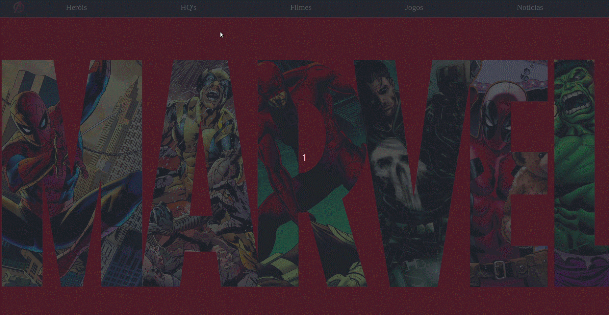

# Criando um Menu Responsivo utilizando Styled-Components

### Criei um vídeo explicando como criar um Menu Responsivo utilizando Styled Componentes. O vídeo está no  [youtube](https://www.youtube.com/watch?v=pfsC1MPMJnY)

O resultado final é este aqui:

Mostrei passo-a-passo o poder de utilizar CSS in JS e como é fácil realizar manipulações com styled-components.

;)