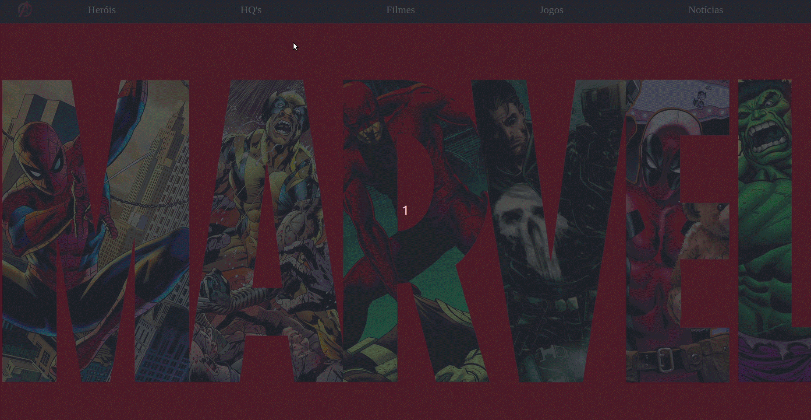

# Criando um Menu Responsivo utilizando Styled-Components
### Versão em TypeScript (TS)

### Criei um vídeo explicando como criar um Menu Responsivo utilizando Styled Componentes. O vídeo está no  [youtube](https://www.youtube.com/watch?v=pfsC1MPMJnY)

O resultado final é este aqui:



Mostrei passo-a-passo o poder de utilizar CSS in JS e como é fácil realizar manipulações com styled-components.

-----

## Mudanças realizadas entre projetos (não afetam o conteúdo final)

Obs.: Devido a atualizações nas bibliotecas utilizadas algumas partes do código ficaram diferentes entre os projetos e isso não apenas pelo fato do uso do TypeScript mas também por mudanças nas versões das bibliotecas.

Uma das alterações relevantes é o fato do primeiro projeto utilizar a versão `react: "^16.13.1"` e para o projeto com TS a versão do React atual é a `"react": "^18.2.0"`

Com isso pode ser observado que não é mais necessário declarar a importação do React em cada arquivo, como feito na versão `16.*` utilizada no projeto original.

// v.16.*
```javascript
import React, { memo, useState } from 'react'
```

// v.18.*
```javascript
import { memo, useState } from 'react'
```

Outras mudanças também foram realizadas, são elas:

```typescript
const projectTheme: ThemeProps = {
  theme: {
    primary: '#202020',
    secondary: '#393939'
  }
}

const root = ReactDOM.createRoot(
  document.getElementById('root') as HTMLElement
)

root.render(
  <React.StrictMode>
    <GlobalStyle />
    <ThemeProvider
      theme={{
        ...projectTheme.theme,
        ...media
      }}
    >
      <App />
    </ThemeProvider>
  </React.StrictMode>
)
// ./index.tsx
```

Adição da pasta `types`, contendo uma interface Global

```typescript
export {}

declare global {
  interface ThemeProps {
    theme: {
      primary: string
      secondary: string
    }
  }
}
```

Modificação da logo para não quebrar a semântica html. A versão original utiliza a tag `<a>` e agora alterei para `<button>`. Com isso o CSS também sofreu alterações:

```typescript
<LogoStyled>
  <button onClick={() => window.location.href = '/'}>
    
  </button>
</LogoStyled>
// ./components/Header/index.tsx:21
```

```javascript
  export const LogoStyled = styled.div`
    position: absolute;
    height: 100%;
    display: flex;
    align-items: center;
    padding-left: 40px;
    :hover {
      cursor: pointer;
    }
    button {
      all: unset; // remover o estilo do botão
    }
  `
// ./components/Header/style.ts:12
```

Existem outras modificações com relação a tipagem, estas podem ser observadas nos arquivos do projeto.

Este projeto foi criado utilizado o CRA com o template TypeScript
```
$ yarn create react-app responsive-menu-styled-components-typescript --template typescript
```
[Saiba mais em create-react-app.dev](https://create-react-app.dev/docs/adding-typescript/)


## Comandos para executar o projeto

Install
```cmd
$ yarn 
```
ou
```cmd
$ npm install 
```

Start
```cmd
$ yarn start
```
ou
```cmd
$ npm run start
```
